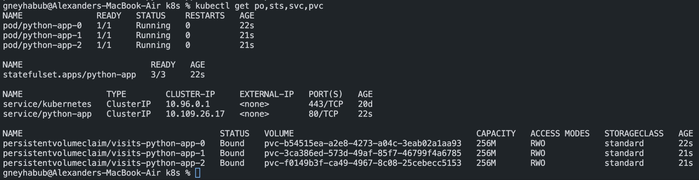

# Stateful set
## Output of the `kubectl get po,sts,svc,pvc`

## Contents of the file for each pod

The number of visits to each of the PODs is different here, because the Stateful Set gives each POD it's own Persistent Volume Claim.

## Ordering
Our app doesn't need any ordering of the PODs because they do not depend on each other. If we had something like database and a microservice that uses it, we would want the database to start first.

## Parallelizm:
In order to make all pods start and exit in parallel we can set podManagementPolicy to Parallel in the Stateful Set spec.