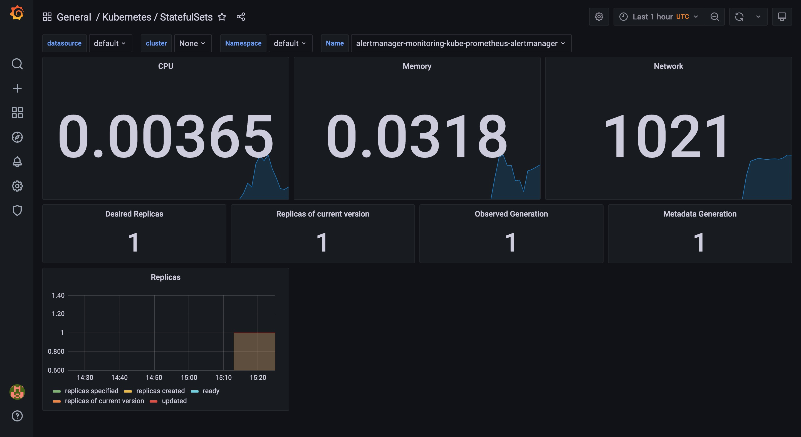
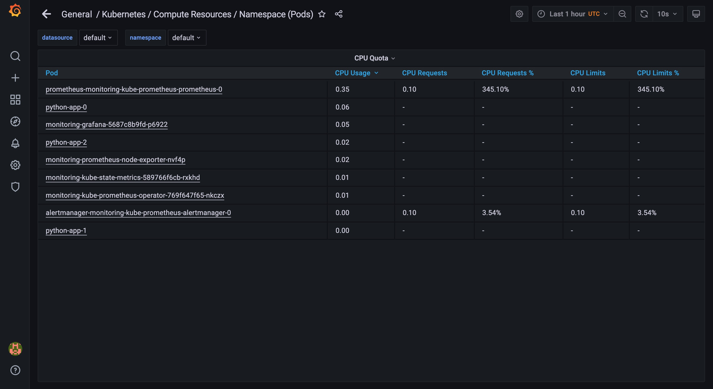
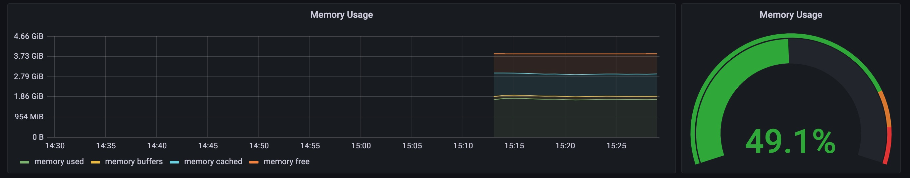
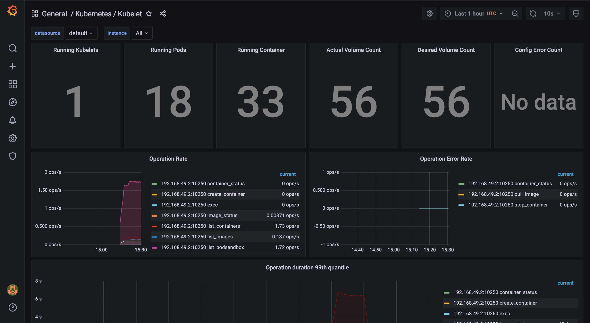
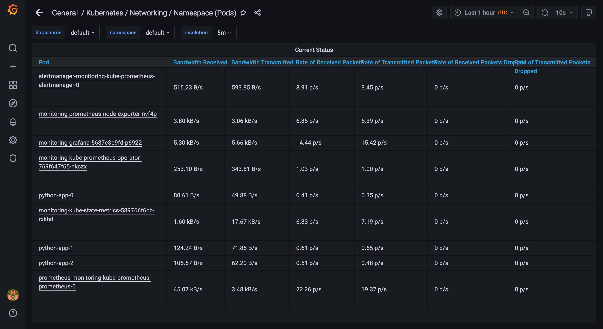
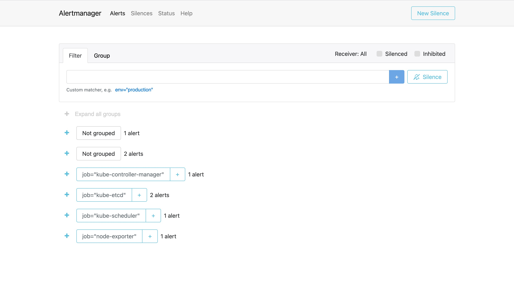
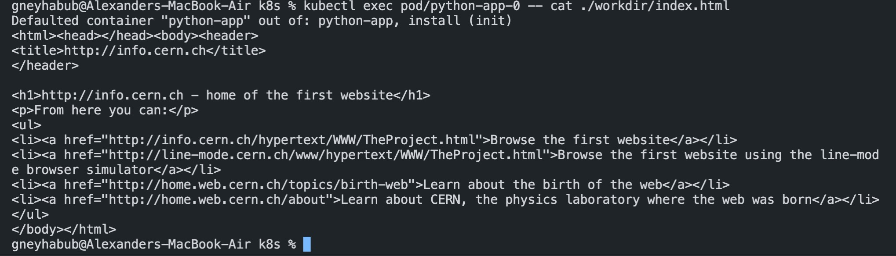

# Prometheus
## Components:
1. Prometheus Operator - prometheus wrapper to use it in kubernetes. Some kind of prometheus plugin for the k8s.
2. Prometheus itself. Toolkit for monitoring.
3. Alertmanager - tool for handling and managing alerts.
4. Node exporter - tool for collecting metrics from the host. Things like CPU percentage, network bandwidth and etc.
5. Prometheus Adapter for Kubernetes Metrics APIs - proxy between the prometheus and kubernetes metrics. Set of APIs so that prometheus is able to collect data from the k8s.
6. kube-state-metrics - tool to collect metrics about the k8s objects.
7. React app for visualization of analytics.

## Info about the cluster:

1. How much CPU and Memory your StatefulSet is consuming:

2. CPU usage per POD (prometheus uses the most and and python-app-1 is least):

3. The app uses around 475Mb (3.8Gib) for the app and 49.1%:

4. 18 PODs and 33 containers:

5. Alert manager uses most of the network and State Metrics use least:

6. 6 alerts in total:

## Init containers:
