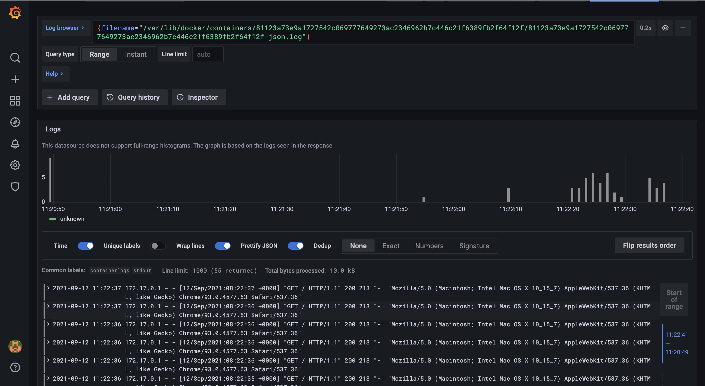

# Monitoring:
## Best practices:
1. Think about the disk space - logs can easily take it all. Either dump old logs, or make sure that you add new disk space as the existing one runs out.
## Logs from the python_app:
