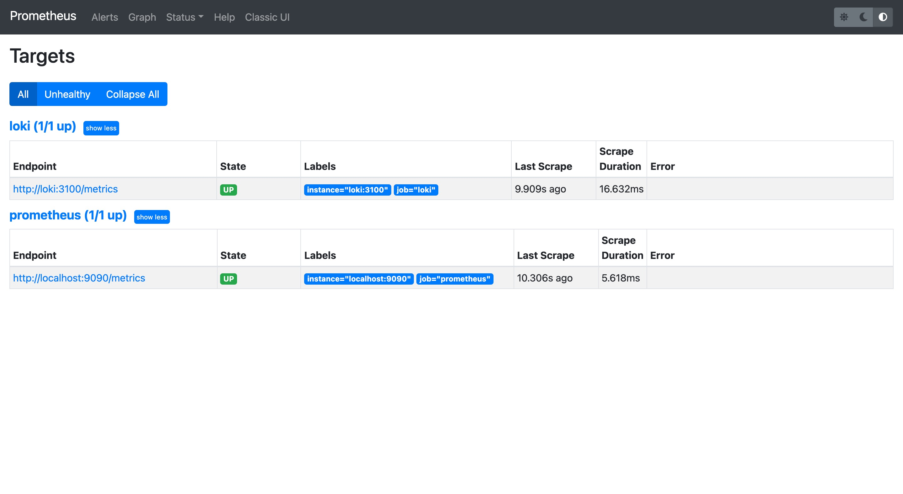
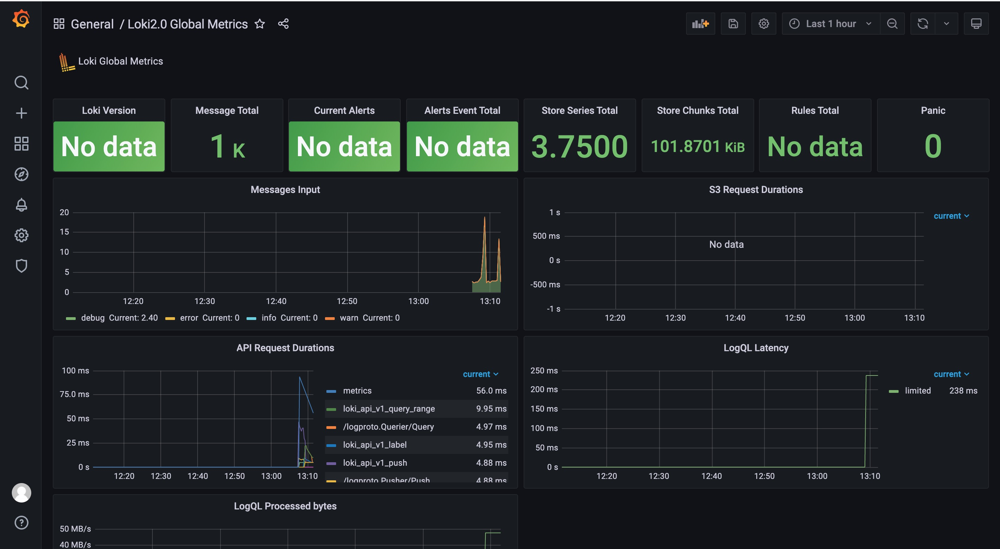
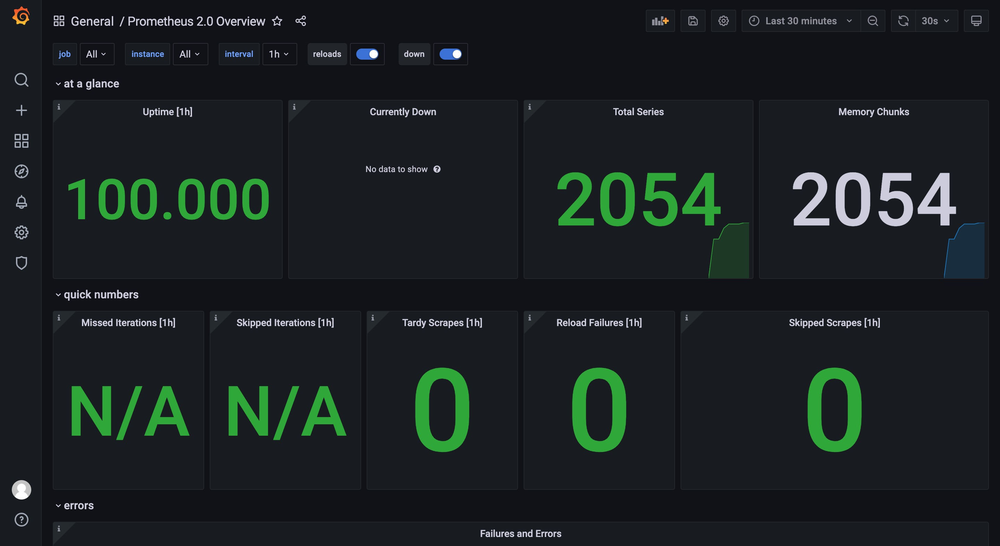

# Monitoring:
## Best practices:
1. Think about the disk space - logs can easily take it all. Either dump old logs, or make sure that you add new disk space as the existing one runs out.
2. Dashboards should reduce cognitive load, not add to it. Cognitive load is basically how hard you need to think about something in order to figure it out. Make your dashboard easy to interpret.
3. When creating a new dashboard, make sure it has a meaningful name.
4. Reuse your dashboards and enforce consistency by using templates and variables.
## Logs from the python_app:

## Prometheus: 

## Dashboards: 

